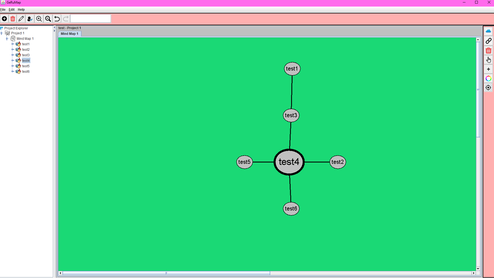
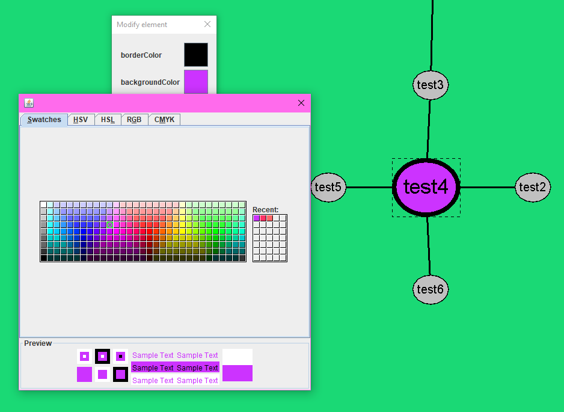
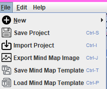

GeRuMap - a mind map managing software, where users can create, manage, save, export, customize their mindmaps. Made together with Mihailo Đorđević from Računarski fakultet university. The project relies heavily un a number of design patterns, namely: factory, abstract factory, interface abstraction, singleton, command, state, logger, observer, mvc

Lazar Bojanic 116/21 RN - Mihailo Đorđević 30/20 RN

Notion: https://www.notion.so/GeRuMap-911ef112735a433eb6043065a489ceaa

Notion Class Diagram: https://www.notion.so/Class-Diagram-88e9c5b0d7504dd5b7f877eacdd1572f

Notion Use Case Diagram: https://www.notion.so/Use-Case-Diagram-9d6e948169174a9b8719ca0fd9e592e5
